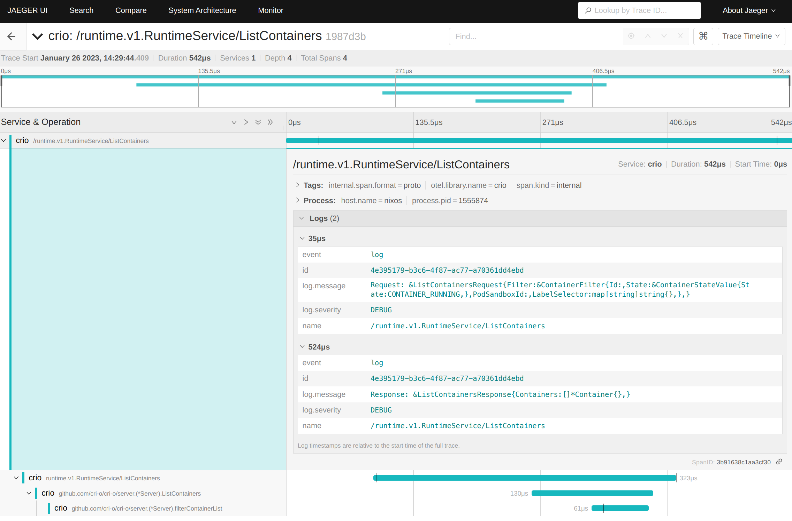

# CRI-O Tracing

## Configuration

To enable [OpenTelemetry][otel] tracing support in CRI-O, either start `crio`
with `--enable-tracing` or add the corresponding option to a config overwrite,
for example `/etc/crio/crio.conf.d/01-tracing.conf`:

[otel]: https://opentelemetry.io

```toml
[crio.tracing]
enable_tracing = true
```

Traces in CRI-O get exported via the [OpenTelemetry Protocol][otlp] by using an
[gRPC][grpc] endpoint. This endpoint defaults to `0.0.0.0:4317`, but can be
configured by using the `--tracing-endpoint` flag or the corresponding TOML
configuration:

[otlp]: https://github.com/open-telemetry/opentelemetry-specification/blob/main/specification/protocol/otlp.md
[grpc]: https://github.com/open-telemetry/opentelemetry-specification/blob/main/specification/protocol/otlp.md#otlpgrpc

```toml
[crio.tracing]
tracing_endpoint = "0.0.0.0:4317"
```

The final configuration aspect of OpenTelemetry tracing in CRI-O is the
`--tracing-sampling-rate-per-million` / `tracing_sampling_rate_per_million`
configuration, which refers to the amount of samples collected per million
spans. This means if it being set to `0` (the default), then CRI-O will not
collect any traces at all. If set to `1000000` (one million), then CRI-O will
create traces for all created spans. If the value is below one million, then
there is **no** way right now to select a subset of spans other than the modulo
of the set value.

[conmon-rs][conmon-rs] has the capability to add additional tracing past the
scope of CRI-O. This is automatically enabled when the `pod` runtime type is
chosen, like so:

```toml
[crio.runtime]
default_runtime = "runc"

[crio.runtime.runtimes.runc]
runtime_type = "pod"
```

[conmon-rs]: https://github.com/containers/conmon-rs

Then conmon-rs will export traces and spans in the same way CRI-O does
automatically. Both CRI-O and conmon-rs will correlate their logs to the traces
and spans. If the connection to the OTLP instance gets lost, then CRI-O will not
block, and all the traces during that time will be lost.

## Usage example

The [OpenTelemetry Collector][collector] alone cannot be used to visualize
traces and spans. For that a frontend like [Jaeger][jaeger] can be used to
connect to it. To achieve that, a configuration file for OTLP needs to be
created, like this `otel-collector-config.yaml`:

[jaeger]: https://www.jaegertracing.io
[collector]: https://opentelemetry.io/docs/collector

```yaml
receivers:
  otlp:
    protocols:
      http:
      grpc:

exporters:
  logging:
    loglevel: debug

  jaeger:
    endpoint: localhost:14250
    tls:
      insecure: true

processors:
  batch:

extensions:
  health_check:
  pprof:
    endpoint: localhost:1888
  zpages:
    endpoint: localhost:55679

service:
  extensions: [pprof, zpages, health_check]
  pipelines:
    traces:
      receivers: [otlp]
      processors: [batch]
      exporters: [logging, jaeger]
    metrics:
      receivers: [otlp]
      processors: [batch]
      exporters: [logging]
```

The `jaeger` `endpoint` has been set to `localhost:14250`, means before starting
the collector we have to start the jaeger instance:

```bash
podman run -it --rm --network host jaegertracing/all-in-one:1.41.0
```

After jaeger is up and running we can start the OpenTelemetry collector:

```bash
podman run -it --rm --network host \
    -v ./otel-collector-config.yaml:/etc/otel-collector-config.yaml \
    otel/opentelemetry-collector:0.70.0 --config=/etc/otel-collector-config.yaml
```

The collector logs will indicate that the connection to Jaeger was successful:

```text
2023-01-26T13:26:22.015Z        info    jaegerexporter@v0.70.0/exporter.go:184  \
    State of the connection with the Jaeger Collector backend \
    {"kind": "exporter", "data_type": "traces", "name": "jaeger", "state": "READY"}
```

The Jaeger UI should be now available on `http://localhost:16686`.

It's now possible to start CRI-O with enabled tracing:

```bash
sudo crio --enable-tracing --tracing-sampling-rate-per-million 1000000
```

And when now running a CRI API call, for example by using [`crictl`][crictl]:
[crictl]: https://github.com/kubernetes-sigs/cri-tools

```bash
sudo crictl ps
```

Then the OpenTelemetry collector will indicate that it has received new traces
and spans, where the trace with the ID `1987d3baa753087d60dd1a566c14da31`
contains the invocation for listing the containers via `crictl ps`:

```text
Span #2
    Trace ID       : 1987d3baa753087d60dd1a566c14da31
    Parent ID      :
    ID             : 3b91638c1aa3cf30
    Name           : /runtime.v1.RuntimeService/ListContainers
    Kind           : Internal
    Start time     : 2023-01-26 13:29:44.409289041 +0000 UTC
    End time       : 2023-01-26 13:29:44.409831126 +0000 UTC
    Status code    : Unset
    Status message :
Events:
SpanEvent #0
     -> Name: log
     -> Timestamp: 2023-01-26 13:29:44.409324579 +0000 UTC
     -> DroppedAttributesCount: 0
     -> Attributes::
          -> log.severity: Str(DEBUG)
          -> log.message: Str(Request: &ListContainersRequest{Filter:&ContainerFilter{Id:,State:&ContainerStateValue{State:CONTAINER_RUNNING,},PodSandboxId:,LabelSelector:map[string]string{},},})
          -> id: Str(4e395179-b3c6-4f87-ac77-a70361dd4ebd)
          -> name: Str(/runtime.v1.RuntimeService/ListContainers)
SpanEvent #1
     -> Name: log
     -> Timestamp: 2023-01-26 13:29:44.409813328 +0000 UTC
     -> DroppedAttributesCount: 0
     -> Attributes::
          -> log.severity: Str(DEBUG)
          -> log.message: Str(Response: &ListContainersResponse{Containers:[]*Container{},})
          -> name: Str(/runtime.v1.RuntimeService/ListContainers)
          -> id: Str(4e395179-b3c6-4f87-ac77-a70361dd4ebd)
```

We can see that there are `SpanEvent`s attached to the `Span`, carrying the log
messages from CRI-O. The visualization of the trace, its spans and log messages
can be found in Jaeger as well, under
`http://localhost:16686/trace/1987d3baa753087d60dd1a566c14da31`:



If kubelet tracing is enabled, then the spans are nested under the kubelet
traces. This is caused by the CRI calls from the kubelet, which propagates the
trace ID through the gRPC API.
